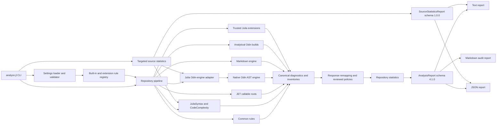
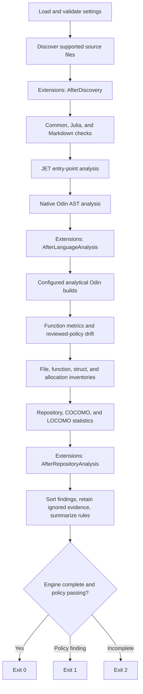
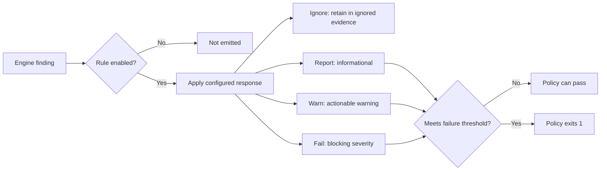
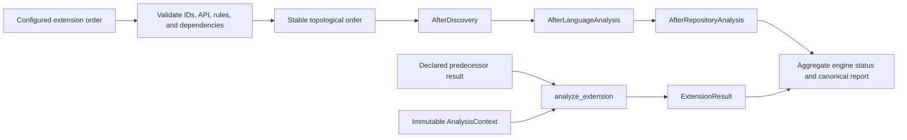

# Odin/Julia Analysis

Static analysis and policy enforcement for codebases that combine Odin, Julia, and their
supporting Markdown documentation.

`OdinJuliaAnalysis` provides one repository-level view across both programming languages:
parser-backed source checks, function metrics, JET inference, analytical Odin builds,
allocation evidence, policy exceptions with drift detection, repository statistics, and
project-specific trusted extensions. Configured LCOV tracefiles can be correlated with
static test reachability without making the analyzer responsible for running tests.

## Table of Contents

- [At a Glance](#at-a-glance)
- [Requirements](#requirements)
- [Quick Start](#quick-start)
- [Command-Line Interface](#command-line-interface)
- [Architecture](#architecture)
  - [Component Map](#component-map)
  - [Analysis Pipeline](#analysis-pipeline)
  - [Project Layout](#project-layout)
- [Analysis Capabilities](#analysis-capabilities)
  - [Rule Families](#rule-families)
  - [Repository Statistics](#repository-statistics)
  - [Targeted Source Statistics](#targeted-source-statistics)
  - [Analytical Odin Builds](#analytical-odin-builds)
  - [Test Coverage Evidence](#test-coverage-evidence)
- [Configuration](#configuration)
  - [Settings Model](#settings-model)
  - [Responses and Exit Behavior](#responses-and-exit-behavior)
  - [Profiles and Exclusions](#profiles-and-exclusions)
  - [JET Entry Points](#jet-entry-points)
  - [Reviewed Policies](#reviewed-policies)
- [Trusted Extensions](#trusted-extensions)
  - [Extension Contract](#extension-contract)
  - [Lifecycle and Dependencies](#lifecycle-and-dependencies)
  - [Result Contract](#result-contract)
- [Reports and Artifacts](#reports-and-artifacts)
- [Using the Sample](#using-the-sample)
- [Testing the Analyzer](#testing-the-analyzer)
- [Integration Guide](#integration-guide)
- [Troubleshooting](#troubleshooting)
- [License](#license)

## At a Glance

| Capability | Implementation | Result |
| --- | --- | --- |
| Julia analysis | JuliaSyntax, CodeComplexity, and JET | Syntax, declarations, metrics, naming, and inference findings |
| Odin analysis | Native Odin AST helper | Syntax, declarations, metrics, naming, and allocation evidence |
| Markdown analysis | MarkdownAST-backed Julia engine | Structure, links, and image accessibility policy |
| Cross-language policy | Canonical repository model and extensions | One rule registry, response model, report, and exit code |
| Build validation | Configured analytical Odin builds | Compiler commands, streams, artifacts, and failure diagnostics |
| Policy exceptions | Exact reviewed policies | Reasoned exceptions with bounded drift enforcement |
| Reporting | Text, JSON, and Markdown | Human feedback, machine contract, and audit artifact |
| Extensibility | Trusted in-process Julia extensions | Project rules without modifying analyzer internals |

| Project contract | Current value |
| --- | --- |
| Package | `OdinJuliaAnalysis` |
| Package version | `0.1.0` |
| Analysis schema | `4.1.0` |
| Extension API | `2.0.0` |
| Native Odin schema | `3.12.0` |
| Native Odin engine | `0.14.0` |
| Julia compatibility | `1.12` |
| Built-in rules | 70 |
| Source types | `.jl`, `.odin`, `.md` |
| License | The Unlicense |

## Requirements

| Requirement | Purpose |
| --- | --- |
| Julia 1.12 | Analyzer orchestration, Julia parsing, JET, policy, and reporting |
| Odin compiler on `PATH` | Native Odin analysis engine and analytical builds |
| Git checkout or package installation | Analyzer source, default settings, and Odin helper source |

Install Julia dependencies from the project directory:

```sh
julia --project=. -e 'using Pkg; Pkg.instantiate()'
```

Confirm both toolchains:

```sh
julia --version
odin version
```

## Quick Start

Analyze the current directory with the packaged settings:

```sh
julia --project=. analyze.jl check .
```

Analyze another repository with its own settings:

```sh
julia --project=. analyze.jl check /path/to/project \
  --settings=/path/to/project/analysis_settings.jl
```

Write machine output and a compact Markdown review report:

```sh
julia --project=. analyze.jl check /path/to/project \
  --settings=/path/to/project/analysis_settings.jl \
  --format=json \
  --progress=always \
  --report=/path/to/project/.build/reports/analysis.md
```

Measure one source file without running repository verification:

```sh
julia --project=. analyze.jl stats src/analysis/reachability_engine.jl
julia --project=. analyze.jl stats src/analysis/reachability_engine.jl \
  --function=declaration_call_roots
```

> The packaged [`settings.jl`](settings.jl) is the analyzer's self-analysis policy. A
> consuming repository should own a settings file tailored to its entry points, build
> targets, responses, reviewed policies, and extensions. The [`sample/`](sample/)
> project is the reference consumer.

## Command-Line Interface

```text
julia analyze.jl check [PATH] [OPTIONS]
```

`PATH` defaults to the current directory for `check`.

| Option | Values | Default | Purpose |
| --- | --- | --- | --- |
| `--format` | `text`, `json` | `text` | Select terminal or canonical machine output |
| `--color` | `auto`, `always`, `never` | `auto` | Control ANSI styling in text output |
| `--progress` | `auto`, `always`, `never` | `auto` | Control milestones written to stderr |
| `--settings` | File path | Packaged `settings.jl` | Load an `AnalysisSettings` value |
| `--report` | File path | None | Write the compact Markdown review artifact |
| `--full-report` | File path | None | Write the comprehensive Markdown audit artifact |
| `-h`, `--help` | - | - | Show command help |

Targeted source statistics use a separate command and do not load settings or evaluate
policy:

```text
julia analyze.jl stats FILE [OPTIONS]
```

| Option | Values | Default | Purpose |
| --- | --- | --- | --- |
| `--function` | Exact function name | None | Return every exact name match |
| `--line` | Positive source line | None | Return the innermost function containing the line |
| `--format` | `text`, `json` | `text` | Select human or versioned machine output |
| `-h`, `--help` | - | - | Show command help |

`--function` and `--line` are mutually exclusive. Without either selector, `stats`
returns file measurements and every measured function or procedure in source order.

Progress always uses stderr. Text or JSON report data always uses stdout, so machine
consumers can safely redirect stdout while retaining live progress.

| Exit code | Meaning | Typical cause |
| ---: | --- | --- |
| `0` | Analysis completed and policy passed | No finding met the configured failure threshold |
| `1` | Analysis completed and policy failed | A finding met or exceeded the failure threshold |
| `2` | Analysis was incomplete or invocation was invalid | Engine failure, extension failure, bad settings, or bad CLI usage |

For `stats`, exit code `0` means measurements were produced and exit code `2` means the
input, selector, parser, or language engine failed. It never returns policy exit code
`1`.

## Architecture

### Component Map



The Julia package owns orchestration and policy. The native Odin executable owns
parser-backed Odin facts. Engines do not independently decide the final process result;
they contribute canonical diagnostics and status records to one report.

### Analysis Pipeline



### Project Layout

| Path | Responsibility |
| --- | --- |
| [`analyze.jl`](analyze.jl) | Activates the package and invokes the CLI |
| [`self-test.jl`](self-test.jl) | Runs analyzer tests and analyzer self-analysis with text or JSON output |
| [`settings.jl`](settings.jl) | Self-analysis policy and complete configuration example |
| [`tools/Verification.jl`](tools/Verification.jl) | Include-based, caller-driven verification progress and report formatting |
| [`src/OdinJuliaAnalysis.jl`](src/OdinJuliaAnalysis.jl) | Public module, CLI parsing, and canonical pipeline |
| [`src/configuration/`](src/configuration/) | Settings types/loading and the built-in rule registry |
| [`src/core/`](src/core/) | Canonical model, discovery, statistics, and extension lifecycle |
| [`src/analysis/`](src/analysis/) | Cross-language rules, architecture, unused imports, interop, and reviewed policies |
| [`src/julia_engine/`](src/julia_engine/) | JuliaSyntax-backed analysis and metrics |
| [`src/jet_engine/`](src/jet_engine/) | JET callable-root analysis |
| [`src/odin_engine/`](src/odin_engine/) | Julia adapter for the native Odin engine |
| [`odin_engine/`](odin_engine/) | Native Odin parser, analyzer, and native tests |
| [`src/markdown_engine/`](src/markdown_engine/) | Markdown structure checks |
| [`src/reporting/`](src/reporting/) | Text, JSON, and compact Markdown renderers |
| [`test/`](test/) | Analyzer regression suite |
| [`sample/`](sample/) | Standalone Odin/Julia consumer and integration example |

## Analysis Capabilities

### Rule Families

The registry contains 70 built-in rules. Every configured rule has an enablement flag and
one response: `Ignore`, `Report`, `Warn`, or `Fail`.

| Family | Rules | Evidence and intent |
| --- | ---: | --- |
| Common source hygiene | 4 | Line tiers at 90, 100, and 120 columns; tab detection |
| Cross-language analysis and policy | 9 | Architecture, call-graph uncertainty, security boundaries, and reviewed-policy drift |
| Julia core and metrics | 23 | Syntax, behavior, duplicate code, reachability, naming, mutable globals, documentation, metrics, unused imports, and JET |
| Odin core, metrics, builds, and allocations | 29 | Syntax, duplicate code, reachability, naming, globals, documentation, metrics, builds, and allocation evidence |
| Markdown structure | 5 | Single H1, heading progression, fenced-code language tags, relative links, and image alt text |

Representative rule IDs:

| Concern | Julia | Odin | Shared or Markdown |
| --- | --- | --- | --- |
| Syntax | `JULIA-SYNTAX` | `ODIN-SYNTAX` | - |
| Naming | `JULIA-NAMING` | `ODIN-NAMING` | `NAMING-POLICY-DRIFT` |
| Mutable globals | `JULIA-NONCONST-GLOBAL`, `JULIA-CONST-MUTABLE-REF` | `ODIN-NONCONST-GLOBAL` | - |
| Behavior | `JULIA-EMPTY-CATCH`, `JULIA-BROAD-CATCH`, `JULIA-UNSIGNALED-ARGUMENT-MUTATION`, `JULIA-GLOBAL-WRITE` | - | `SECURITY-UNSAFE-BOUNDARY` |
| Duplicate code | `JULIA-DUPLICATE-CODE` | `ODIN-DUPLICATE-CODE` | `DUPLICATE-CODE-POLICY-DRIFT` |
| Function size | `JULIA-FUNCTION-LINES-*` | `ODIN-FUNCTION-LINES-*` | `FUNCTION-METRIC-POLICY-DRIFT` |
| Complexity | `JULIA-CYCLOMATIC-*` | `ODIN-CYCLOMATIC-*` | - |
| Parameters | `JULIA-PARAMETERS-FAIL` | `ODIN-PARAMETERS-WARN`, `ODIN-PARAMETERS-FAIL` | `FUNCTION-METRIC-POLICY-DRIFT` |
| Tuple returns | `JULIA-RETURN-TUPLE` | `ODIN-RETURN-TUPLE` | - |
| Documentation | `JULIA-DOC-MISSING` | `ODIN-DOC-MISSING` | `MARKDOWN-*` |
| Static inference | `JULIA-JET-POSSIBLE-ERROR` | - | - |
| Reachability | `JULIA-UNREACHABLE-FUNCTION` | `ODIN-UNREACHABLE-PROCEDURE` | `CALL-GRAPH-UNRESOLVED-EDGE`, `CALL-ROOT-POLICY-DRIFT` |
| Allocation | - | `ODIN-ALLOCATION-*` | `ODIN-ALLOCATION-POLICY-DRIFT` |
| Build health | - | `ODIN-BUILD-FAILED` | - |

The `*-REPORT`, `*-WARN`, and `*-FAIL` metric rules use exact, increasing thresholds.
This preserves low-severity visibility without making every review signal block a build.
`JULIA-CONST-MUTABLE-REF` warns when a module-scope `const` binding constructs `Ref`,
`Ref{T}`, or a standard qualified `Ref`/`RefValue`. The binding is constant, but its
referenced storage remains mutable; the rule is `probable` because syntax alone cannot
prove that an unqualified `Ref` name has not been shadowed.

### Repository Statistics

The report includes parser-backed totals rather than filename-only estimates.

| Statistic | Scope |
| --- | --- |
| Files | Julia and Odin source counts by language |
| Functions | Julia functions and Odin procedures |
| Structs | Julia and Odin struct declarations |
| Lines | Physical, blank, comment, and code lines |
| Complexity | Aggregate cyclomatic complexity and complexity per code line |
| COCOMO | Organic-model effort, schedule, staffing, and cost estimate |
| LOCOMO | Token, generation-cycle, generation-time, review-time, and cost estimate |

Markdown files are analyzed for policy but excluded from programming-language code totals.
Bodyless Odin foreign procedures declared with `---` remain in interop signature evidence
but are excluded from function statistics and user-defined procedure rules.

### Targeted Source Statistics

The `stats` command measures exactly one `.jl` or `.odin` file. It reuses JuliaSyntax,
CodeComplexity, the native Odin AST helper, and the same line classifier used by the
repository report, but it does not run discovery, JET, configured Odin builds,
extensions, coverage ingestion, call-graph analysis, or policy rules.

File output includes parse status; physical, source, code, comment, and blank lines;
function and struct counts; total complexity; complexity density; and average and
maximum function complexity and executable size. Function output includes source span,
executable lines, positional parameters, cyclomatic complexity, Julia cognitive
complexity when available, and documentation state.

Exact name selection returns all overloads or repeated names rather than choosing one
silently. Line selection returns the innermost measured function containing that line,
which supports cursor-oriented inspection of nested functions.

File code lines and function executable lines are intentionally different measurements.
Function lines do not necessarily sum to file code lines because files can contain
top-level code and nested function spans can overlap. Statistics are factual signals,
not a composite quality score or a recommendation to refactor.

### Analytical Odin Builds

`OdinBuildSettings` defines compiler invocations that are part of analysis but independent
from an application's normal build system.

```julia
OdinBuildSettings([
    OdinBuildTarget(
        "application",
        "src",
        "application-analysis",
        ["-vet", "-strict-style", "-disallow-do", "-warnings-as-errors"]),
])
```

| Field | Meaning |
| --- | --- |
| `id` | Stable report identity |
| `input` | Target-root-relative Odin package or source file |
| `output_name` | Artifact filename beneath `.build/analysis/odin/` |
| `flags` | Compiler policy applied to the analytical build |
| `include_julia_linker_flags` | Append Julia linker flags resolved via `julia-config.jl` as `-extra-linker-flags` (keyword, default `false`; POSIX only) |

The report retains the complete command, exit code, stdout, stderr, and artifact path.
A failed build emits `ODIN-BUILD-FAILED` using its configured response.

## Configuration

### Settings Model

A settings file is Julia source whose final value is `AnalysisSettings`. It is evaluated
inside an isolated module, validated completely, and resolved into `EffectiveSettings`
before source discovery begins.

| `AnalysisSettings` field | Controls |
| --- | --- |
| `profile` | Initially selected scan profile |
| `failure_threshold` | Minimum response that produces exit code 1 |
| `thresholds` | Common line and legacy metric thresholds |
| `profiles` | Named path-exclusion sets |
| `rules` | Rule enablement and response remapping |
| `naming` | Language conventions and exact reviewed exceptions |
| `jet` | Callable roots and representative argument types |
| `odin_build` | Analytical compiler targets |
| `return_tuples` | Julia and Odin tuple-return maximums |
| `parameter_counts` | Language-specific parameter limits |
| `function_metrics` | Per-language line and cyclomatic response tiers |
| `architecture` | Repository path layers and exact allowed dependency directions |
| `allocations` | Known allocators, source patterns, and reviewed evidence |
| `report` | Text finding limits, color default, and staging-path response cap |
| `extensions` | Ordered trusted extension values |
| `duplicate_code` | Exact whole-body clone thresholds and reviewed clones |
| `resource_lifetime` | Configured ownership and lifetime summaries |
| `security` | Configured trust-boundary source, sink, and sanitizer calls |
| `coverage` | LCOV tracefiles and Markdown high-risk presentation limit |
| `documentation` | Required Julia docstring and Odin doc-comment regex templates |
| `call_roots` | Cross-language callable entry points outside parser-visible call edges |

Settings validation rejects malformed thresholds, duplicate profile names, unknown rules,
duplicate rule IDs, invalid reviewed policies, invalid build targets, malformed or
overlapping architecture ownership, extension API mismatches, unknown extension
dependencies, and extension dependency cycles.

### Documentation Templates

`DocumentationSettings` defines one regex template per language. Both default to
`r"\S"`, requiring parser-attached documentation with at least one non-whitespace
character. A stricter policy can require named sections:

```julia
DocumentationSettings(
  r"(?m)^# Parameters$",
  r"(?m)^Parameters:$")
```

Julia applies the template to docstring content and accepts a function family when at
least one overload has a matching docstring. Odin applies it to attached procedure doc
comments after removing comment delimiters. Configure finding severity through the
existing `JULIA-DOC-MISSING` and `ODIN-DOC-MISSING` `RuleSetting` entries using
`Report`, `Warn`, or `Fail`. Templates that match empty text are rejected.

### Responses and Exit Behavior



`Ignore` does not erase evidence: ignored diagnostics and per-rule counts remain in the
canonical report. Engine failures and incomplete extension results always produce exit
code 2, independent of the policy threshold.

`ReportSettings.staging_maximum_response` caps findings for any file whose name starts
with `staging_` or whose path contains a directory starting with `staging_`. `Ignore`
retains all such findings only as ignored evidence, while `Fail` leaves their configured
rule responses unchanged.

### Profiles and Exclusions

A `ScanProfile` selects target-root-relative files or directory prefixes to exclude from
enforcement:

```julia
ScanProfile(:default, ["vendor", "generated/api.jl"])
```

Discovery recursively includes `.jl`, `.odin`, and `.md` files. The following directories
are always skipped:

| Directory | Reason |
| --- | --- |
| `.git` | Version-control internals |
| `.build` | Generated analyzer and project artifacts |
| `bin` | Built application output |

Exclusions are normalized path-prefix matches. They are not regular expressions or glob
patterns.

### JET Entry Points

JET runs against configured callable roots, not every Julia file in isolation:

```julia
JetSettings([
    JetEntryPoint(
        "application-main",
        "src/Application.jl",
        Application.main,
        (Vector{String},)),
])
```

| Field | Meaning |
| --- | --- |
| `id` | Stable entry-point identity |
| `path` | Owning source path for diagnostics |
| `callable` | Julia function analyzed with `report_call` |
| `argument_types` | Representative positional argument-type tuple |

Choose application, service, callback, and CLI boundaries whose transitive call graphs
represent real execution. Dependency-internal findings are not promoted as repository
findings.

### Cross-Language Call Roots

Bridges call across languages by symbol name at runtime, so no parser-visible edge
reaches the callable and reachability reports its whole subtree as unreachable. Declare
those boundaries instead of suppressing the rule:

```julia
CallRootSettings([
    CallRootEntryPoint(
        "odin-bridge:init_scripts",
        :julia,
        "init_scripts",
        "src/bridge/bootstrap.odin resolves this symbol through jl_get_function"),
])
```

| Field | Meaning |
| --- | --- |
| `id` | Stable entry-point identity |
| `language` | Language of the entered callable, `:julia` or `:odin` |
| `name` | Callable name, either unqualified or fully qualified |
| `reason` | Why the callable is entered from outside its call graph |

Every declared callable matching `name` becomes a `bridge` call root, so one entry covers
a convention implemented by many modules. Entries matching no declaration become blocking
`CALL-ROOT-POLICY-DRIFT` findings rather than silently suppressing reachability.
The analyzer also infers conventional `main` roots, test roots, exported bridge/callback
roots, JET roots, and Odin procedures marked `@(init)`. Odin initialization procedures
run before `main`, so they participate in reachability without manual configuration.

### Reviewed Policies

Reviewed policies make deliberate exceptions visible and drift checked.

| Policy | Exact match dimensions | Drift rule |
| --- | --- | --- |
| `ReviewedNamingPolicy` | Path, language, declaration kind, and name | `NAMING-POLICY-DRIFT` |
| `ReviewedComplexity` | Path, language, function, and metric | `FUNCTION-METRIC-POLICY-DRIFT` |
| `ReviewedAllocationPolicy` | Path, procedure, category, operation, target, source, and certainty | `ODIN-ALLOCATION-POLICY-DRIFT` |
| `ReviewedDiagnosticPolicy` | Rule ID, path, and subject | `REVIEWED-DIAGNOSTIC-POLICY-DRIFT` |
| `CallRootEntryPoint` | Language and callable name | `CALL-ROOT-POLICY-DRIFT` |
| `ReviewedImportPolicy` | Path, language, and imported binding | `IMPORT-POLICY-DRIFT` |

Every policy records a stable ID, reason, response, and minimum/maximum match count.
Missing, excessive, or ambiguous matches become blocking drift findings instead of
silently preserving stale exceptions.

## Trusted Extensions

Extensions are Julia values loaded by the consuming project's environment. They run
inside the analyzer process with full Julia and OS permissions, so package installation
and dependency review are part of the trust boundary.

### Extension Contract

```julia
struct ProjectExtension <: AnalysisExtension end

extension_id(::ProjectExtension) = "project-policy"
extension_api_version(::ProjectExtension) = EXTENSION_API_VERSION
extension_phases(::ProjectExtension) = Set((AfterRepositoryAnalysis,))
extension_dependencies(::ProjectExtension) = String[]

function extension_rules(::ProjectExtension)
    return RuleDefinition[
        RuleDefinition(
            "PROJECT-ARCHITECTURE",
            "common",
            "Project Architecture",
            "repository inventory",
            "high",
            "default",
            false),
    ]
end

function analyze_extension(extension::ProjectExtension, context, prior_results)
    return ExtensionResult(extension_id(extension), context.phase)
end
```

| Method | Required behavior |
| --- | --- |
| `extension_id` | Return a globally unique, stable, nonempty ID |
| `extension_api_version` | Return the exact supported API version |
| `extension_rules` | Declare every rule the extension may emit |
| `extension_phases` | Select at least one supported lifecycle phase |
| `extension_dependencies` | Name extensions whose results may be consumed |
| `analyze_extension` | Return one valid `ExtensionResult` for the current phase |

Default methods provide API version `2.0.0`, repository phase, no rules, and no
dependencies. `extension_id` and `analyze_extension` must be implemented.

### Lifecycle and Dependencies

| Phase | Available context | Typical use |
| --- | --- | --- |
| `AfterDiscovery` | Root, profile, phase, and normalized source paths | Layout and path policy |
| `AfterLanguageAnalysis` | Parser-backed files with nested functions and evidence, plus repository dependencies and call roots | Declaration, dependency, bridge, and metric policy |
| `AfterRepositoryAnalysis` | Final nested file/function evidence and repository statistics | Cross-file and cross-language policy |



Configured order is the tie-breaker between independent extensions. A dependent receives
only results from dependencies it explicitly names. Self-dependencies, unknown IDs, and
cycles reject configuration before analysis.

### Result Contract

| `ExtensionResult` field | Contract |
| --- | --- |
| `extension_id` | Must match the executing extension |
| `phase` | Must match the current lifecycle phase |
| `status` | `complete`, `incomplete`, `failed`, or `not-applicable` |
| `diagnostics` | May use only rule IDs owned by the extension |
| `artifacts` | Must be a `Dict{String, Any}` containing JSON-serializable values |
| `message` | Optional status or unresolved-analysis evidence |

Core owns response remapping, ignored-finding retention, sorting, serialization,
rendering, and exit semantics. Extensions must not write directly to text, JSON, or
Markdown reports.

Thrown exceptions and invalid results are converted to failed extension results. A
`failed` or `incomplete` extension makes the complete analysis incomplete and exits 2.

See [`sample/analysis_extension.jl`](sample/analysis_extension.jl) for a working rule,
artifact, settings registration, and dynamically loaded extension.

## Dependency Architecture

Core architecture analysis applies project-owned path layers to the canonical dependency
inventory. It is configured through the standard `ArchitectureSettings` field:

```julia
architecture = ArchitectureSettings(
    [
        ArchitectureLayer("application", ["src/app", "src/main.jl"]),
        ArchitectureLayer("library", ["src/lib"]),
    ],
    [ArchitectureDependency("application", "library")])
```

Pass that value between `FunctionMetricSettings` and `AllocationSettings` in the full
`AnalysisSettings` constructor. The three built-in rules are:

- `ARCHITECTURE-FORBIDDEN-DEPENDENCY` reports actual layer directions absent from the
  exact allowed list;
- `ARCHITECTURE-DEPENDENCY-CYCLE` reports strongly connected layer groups;
- `ARCHITECTURE-UNRESOLVED-INTERNAL-IMPORT` reports relative or repository-local imports
  that cannot be resolved.

Layer paths are repository-relative. More-specific paths take precedence over broader
paths, allowing a root layer such as `.` with nested subsystem layers. Julia resolution
uses parser-derived qualified module declarations. Odin collection imports such as
`core:fmt` are external; plain package paths resolve to existing repository directories.

## Resource Lifetime Summaries

Resource lifetime analysis maps parser-backed Odin allocation events to typed project
contracts. Contracts select an allocation category and may narrow by operation or exact
allocator source. Each match records ownership, lifetime, release expectations, escape
permission, and the reason for the contract:

```julia
ResourceLifetimeSettings(true, [
  ResourceLifetimeContract(
    "temporary-slice",
    :temporary,
    :borrowed,
    :temporary,
    "The temporary allocator owns storage until its scope ends.";
    operation="make",
    allocator_source="context.temp_allocator",
    allows_escape=false),
])
```

The engine is `incomplete` when an allocation has no unique matching contract. This is
intentional: summaries describe configured ownership evidence but do not yet claim
path-sensitive release, transfer, or escape verification.

## Security Boundary Paths

Security analysis uses typed Julia and Odin call contracts for trust-boundary sources,
sinks, and sanitizers. When a configured source call precedes a configured sink call in
the same declaration, the report records a `potential` `SECURITY-UNSAFE-BOUNDARY` path:

```julia
SecuritySettings(
  true,
  [SecurityCallContract(
    "interactive-input", :julia, "readline", :user_input,
    "Interactive input is untrusted.")],
  [SecurityCallContract(
    "process-execution", :julia, "run", :command_execution,
    "The call executes a process.")],
  [SecurityCallContract(
    "input-allowlist", :julia, "validate_input", :allowlist,
    "The call validates input against an allowlist.")])
```

Observed sanitizer calls are retained as evidence and do not automatically suppress the
path. Dynamic calls make the security engine incomplete. The analyzer does not yet claim
argument-level taint flow, command injection, or path traversal; those rules require
parser-backed assignment and argument propagation.
Empty architecture settings are the default, preserve dependency inventory reporting,
and make all three rules `not-applicable`. The default rule responses are `Report` so a
project can add layers without immediately enforcing uncharacterized boundaries.

## Test Coverage Evidence

Coverage analysis consumes LCOV tracefiles produced by the repository's existing test
workflow. The analyzer never launches tests or a coverage tool. Configure normalized,
repository-relative tracefile paths after tests have written them:

```julia
CoverageSettings(true, [".build/coverage/julia.info", ".build/coverage/odin.info"], 20)
```

The final field limits only the risk-ranked gaps shown in Markdown; JSON always retains
every declaration record. Repeated LCOV records and configured tracefiles are merged by
source line. Absolute source paths are accepted only when they resolve inside the
analysis root. Missing or malformed configured input fails the `test-coverage` engine
and produces exit code 2.

Each function or procedure correlates LCOV lines in its source range with the transitive
call closure from static test roots. Evidence is classified as `corroborated`,
`static-only`, `runtime-only`, `uncovered`, `runtime-unavailable`,
`static-unavailable`, or `unavailable`. Static reachability and runtime execution remain
separate fields because neither proves assertion quality.

Risk ranking is a fixed integer calculation:

$\operatorname{risk} = \text{cyclomatic complexity}
  + \left\lceil\frac{\text{executable lines}}{10}\right\rceil
  + \begin{cases}5 & \text{callback or bridge}\\0 & \text{otherwise.}\end{cases}$

Coverage evidence is statistical only. It creates no untested-code policy finding,
reviewed exception, public-API weighting, method-level Julia claim, or assertion-quality
claim.

## Reports and Artifacts

JSON is the canonical machine-readable representation. Text and Markdown are renderings
of the same analysis state.

| Output | Invocation | Intended consumer | Completeness |
| --- | --- | --- | --- |
| Text | Default or `--format=text` | Developer terminal | Curated findings with configured limits |
| JSON | `--format=json` | CI, automation, and downstream tools | Complete `AnalysisReport` schema 4.1.0 |
| Markdown | `--report=PATH` | Review, archival, and audit | Compact statistics and visible findings |
| Full Markdown | `--full-report=PATH` | Deep review and inventory audit | Comprehensive inventories and findings |

The canonical report includes:

| Section | Contents |
| --- | --- |
| Metadata | Schema, tool version, root, profile, thresholds, and exit code |
| Statistics | Language totals, complexity density, COCOMO, and LOCOMO |
| Function thresholds | Configured metric response thresholds |
| Test coverage | Aggregate static/runtime evidence and bounded high-risk gaps |
| Diagnostics | Complete visible report, warning, and failure findings with evidence |
| Engines | Completion status and failure messages |
| Rules | Response, evaluation status, files checked, and finding count |
| Odin builds | Commands, flags, streams, artifacts, status, and exit codes |
| Repository evidence | Dependencies, call roots, diagnostics, engines, builds, and extension results |
| Files | File metrics, nested functions, and evidence not owned by a function |
| Functions | Metrics, declarations, bindings, references, calls, and clone evidence |
| Function analysis | Resource lifetimes, security paths, coverage, and interop evidence |

Schema `4.0.0` removes the former top-level function and evidence arrays. Consumers
traverse `files`, then each file's `functions`; source-located evidence is assigned to
the innermost containing function, while file-scope evidence remains on its file.
Cross-function clone groups and interop pairs are stored once under a deterministic
primary owner. Schema `4.1.0` adds `is_rodata` declaration metadata; existing declaration
kind values remain unchanged.

| Generated path | Owner | Contents |
| --- | --- | --- |
| `.build/odin-engine` | Analyzer package | Cached native Odin analysis executable |
| `<target>/.build/analysis/odin/` | Analyzed repository | Configured analytical Odin build artifacts |
| User-selected `--report` path | Caller | Compact Markdown review report |
| User-selected `--full-report` path | Caller | Comprehensive Markdown audit report |

Generated `.build` directories are excluded from source discovery.

## Using the Sample

[`sample/`](sample/) is a complete minimal consumer with Odin and Julia hello-world
programs, native tests, an analytical Odin build, a JET root, custom settings, and a
trusted extension.

```sh
cd sample
./make.jl build
./make.jl run
./make.jl unit
./make.jl check
./make.jl test \
  --report=.build/reports/analysis.md \
  --full-report=.build/reports/analysis-full.md
```

The sample verification gate mirrors a production repository driver:

```text
VERIFICATION PROGRESS
  [1/3] Build Odin and Julia hello programs
  [2/3] Run Odin and Julia unit tests
  [3/3] Analyze the sample repository
```

| Sample file | Demonstrates |
| --- | --- |
| [`sample/make.jl`](sample/make.jl) | Repository command dispatch |
| [`sample/tools/verify.jl`](sample/tools/verify.jl) | Caller-owned phases using the shared verification module |
| [`sample/analysis_settings.jl`](sample/analysis_settings.jl) | Consumer-owned settings composition |
| [`sample/analysis_extension.jl`](sample/analysis_extension.jl) | Trusted extension rule and artifact |
| [`sample/src/main.odin`](sample/src/main.odin) | Odin source and native entry point |
| [`sample/src/HelloWorldSample.jl`](sample/src/HelloWorldSample.jl) | Julia package source and JET callable |
| [`sample/test/runtests.jl`](sample/test/runtests.jl) | Julia unit tests |

When the sample lives outside this checkout, point it to the analyzer project:

```sh
ODIN_JULIA_ANALYSIS_PROJECT=/path/to/OdinJuliaAnalysis ./make.jl test
```

## Testing the Analyzer

Run the complete analyzer self-verification workflow. It executes the Julia regression
suite, analyzes this repository with [`settings.jl`](settings.jl), prints standardized
progress and summary tables, and optionally writes the canonical Markdown report:

```sh
./self-test.jl --report=.build/report.md
./self-test.jl --format=json > .build/self-test.json
```

The include-based [`tools/Verification.jl`](tools/Verification.jl) module owns the common
phase result, progress, color, table, JSON-envelope, and analyzer-statistics formatting.
Repository drivers remain responsible for defining commands, phases, CLI policy, and
optional report-section callbacks.

Run the package regression suite:

```sh
julia --project=. -e 'using Pkg; Pkg.test()'
```

Run the native Odin engine tests directly:

```sh
odin test odin_engine \
  -vet \
  -strict-style \
  -disallow-do \
  -warnings-as-errors
```

Analyze the analyzer with its packaged policy:

```sh
julia --project=. analyze.jl check . \
  --settings=settings.jl \
  --report=.build/reports/self-analysis.md
```

| Test surface | Coverage |
| --- | --- |
| Julia regression suite | Settings, engines, metrics, reports, policies, CLI, and extensions |
| Native Odin tests | Odin parser facts, syntax failures, metrics, naming, and allocations |
| Self-analysis | The analyzer's own Julia, Odin, and Markdown source |
| Sample gate | External consumer workflow and settings-loaded extension dispatch |

## Integration Guide

A practical adoption sequence:

1. Instantiate the analyzer and ensure `odin` is on `PATH`.
2. Copy the structural pattern from [`sample/`](sample/), not the analyzer's
   self-analysis settings verbatim.
3. Define one profile and explicitly configure every built-in rule response.
4. Add real Julia callable roots with `JetSettings`.
5. Add strict analytical Odin targets with `OdinBuildSettings`.
6. Run text output locally and archive JSON or Markdown in CI.
7. Promote initially noisy rules from `Report` to `Warn` or `Fail` after reviewing data.
8. Encode legitimate exceptions as exact reviewed policies with match bounds.
9. Add project-specific trusted extensions only where built-in evidence is insufficient.
10. Make analyzer exit codes part of the repository's normal verification gate.

Recommended CI shape:

```sh
julia --project=/path/to/OdinJuliaAnalysis \
  /path/to/OdinJuliaAnalysis/analyze.jl check "$PWD" \
  --settings="$PWD/analysis_settings.jl" \
  --format=json \
  --progress=always \
  --report="$PWD/.build/reports/analysis.md" \
  > "$PWD/.build/reports/analysis.json"
```

## Troubleshooting

| Symptom | Likely cause | Action |
| --- | --- | --- |
| `odin` command not found | Odin is absent from `PATH` | Install Odin or update `PATH` before analysis |
| Settings file does not return `AnalysisSettings` | Final settings expression has the wrong type | Ensure the file's last value is `AnalysisSettings(...)` |
| Unknown rule in settings | Typo or missing extension rule registration | Check the built-in registry and `extension_rules` |
| Duplicate rule ID | Extension ID collides with core or another extension | Namespace project rules and keep IDs globally unique |
| Extension API mismatch | Extension targets another API version | Update the extension or use a compatible analyzer release |
| Extension dependency cycle | Extensions depend on each other transitively | Make dependency direction acyclic |
| Analysis exits 2 | Engine or extension was incomplete | Inspect engine statuses and extension messages in JSON or Markdown |
| JET reports irrelevant dependency internals | Root or ownership path is too broad | Configure concrete repository-owned callable roots |
| Reviewed-policy drift | Source no longer matches bounded evidence | Re-evaluate the code and update or remove the policy intentionally |
| Odin analytical build fails | Input, output, or flags differ from the real package | Inspect the retained command, stdout, and stderr |
| Generated files are unexpectedly analyzed | Output is outside standard excluded directories | Add a profile exclusion or place generated output under `.build` or `bin` |
| JSON consumer breaks | Consumer assumes an older schema | Gate consumers on `schema_version` and migrate deliberately |

For complete evidence, rerun with both machine and audit outputs:

```sh
julia --project=. analyze.jl check /path/to/project \
  --settings=/path/to/project/analysis_settings.jl \
  --format=json \
  --progress=always \
  --report=/path/to/project/.build/reports/analysis.md
```

## License

This project is released into the public domain under [The Unlicense](LICENSE).
